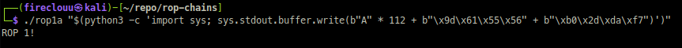

# Red Teamer Hacking

## Motivation
Upon learning much about Virtual Machines, CPU archs, binary dissections, etc., trying vulnerability research might be another way to learn new things when it comes to computing.

## Device
### Latitude 5300
uses vm kali-linux

## my roadmap
- learn basics on cpu flaws and common os protections
- try binary exploitation by writing and explicitly compiling vulnerable programs

## what i learned right now
- extensive use of gdb, and other improvements to gdb like `pwndbg` where it has `cyclic` to do fuzzing
- better to identify what your emulated machine config first before anything else.
- ASLR or Address Space Layout Randomization, randomizes memory everytime our program runs. disabling it helps predict the functions like `exit` fixed on memory layout, avoiding `segfaults`.
- directly writing raw bytes is always needs to be remember. On `python3` im using `print` function which treats our input as `unicode` chars, instead of raw byte. I fail on these, took too much time before i get my first `ret2func` exploit after resolving these. im [following these tutorial](https://www.ired.team/offensive-security/code-injection-process-injection/binary-exploitation/rop-chaining-return-oriented-programming) and it uses python2.

*im happy seeing that string!*

## our cpu of interest
right now im following a `ropchain` exploit being performed on `x86` cpu, similar to what i have as well, and forced to compiled as `32bit` program.  

it is also essential for us to learn about the `cpu registers` just like how I did it on my first interpreter `intel 8080`. `EIP` is the instruction pointer, 
General Purpose registers are `EAX` (used as accumulator), `EBX`, `ECX`, `EDX`.
Pointer and index regs. are `ESP` (stack pointer), `EBP` (base ptr), `ESI` (source index), `EDI` (destination index)
There are also Segment Registers and the Flags.

With those above i'm already familiar with program counter (IP), general purpose regs, stack ptr., and flags. 
Segemnt regs., base ptr, src. and dest. indexes are new to me.

From what i understand, having `ESI/EDI` register allows more faster execution thanks to hardware-accelerated operation, decreasing cpu cycles, unlike old architecture which uses clever programming (but wasting too much cycle) when doing movement ops.

# ROP Exploit
i had to learn both languages once more: c and python3. I also learned ASLRs and how modern OS enforces these `memory randomization` feature. For now we just disable these. stdout and raw bytes gives me a brand new perspective too. For years I thought typed strings or characters are look or appear as it is, as if i didnt even know utf8 exist and interprets everything, and presents clean interpretation to end users. My currently following tutorial is at Python2 and i thought Pyton3's print is the same, and thanks to that and constant failure for basic simulation for exploit, I learned those quirks the hard way, but very interesting in terms of computing!

## Resources
- [ROP Chaining: Return Oriented Programming | Red Team Notes](https://www.ired.team/offensive-security/code-injection-process-injection/binary-exploitation/rop-chaining-return-oriented-programming)

